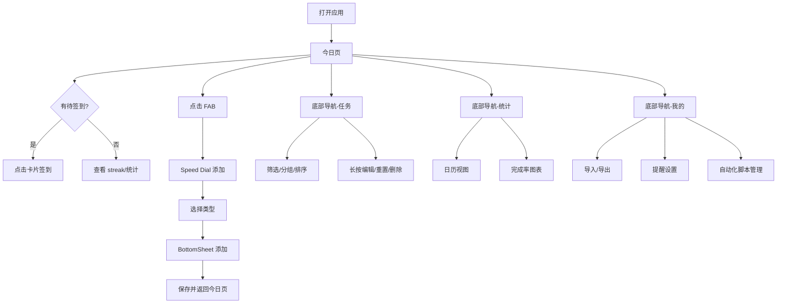

# 签到助手 UI/UX 重构与功能升级设计

**文档版本**: v1.0.0  
**对应产品版本**: 签到大师 v3.3.4  
**文档性质**: 产品重构与升级规划设计（不产出可执行代码）  
**最后更新**: 2026-06-27  

> 本文档基于《签到助手项目产品 PRD 设计》中梳理的现有功能，提出下一阶段 UI/UX 重构方向与产品功能升级路线。所有建议均为设计规划，尚未进入开发阶段。

---

## 目录

1. [设计背景与目标](#1-设计背景与目标)
2. [设计原则](#2-设计原则)
3. [信息架构](#3-信息架构)
4. [视觉风格规范](#4-视觉风格规范)
5. [页面与交互设计](#5-页面与交互设计)
6. [功能升级路线图](#6-功能升级路线图)
7. [数据模型与架构影响](#7-数据模型与架构影响)
8. [风险与兼容性](#8-风险与兼容性)
9. [实施阶段建议](#9-实施阶段建议)
10. [附录：新旧界面对照](#10-附录新旧界面对照)

---

## 1. 设计背景与目标

### 1.1 当前产品现状

当前版本（v3.3.4）已具备完整的签到管理核心能力：
- 三种签到类型（APP / 网站 / 其他任务）
- 天/周/月灵活周期
- 未签到/已签到双 Tab 管理
- 数据导入导出
- 自动化签到框架（无障碍服务）

但产品在视觉表现、信息密度、操作效率和情感化设计上仍有较大提升空间：
- 首页信息单一，缺乏今日任务概览和完成度反馈。
- 卡片布局较为传统，状态表达依赖单一颜色点。
- 添加流程为多层 AlertDialog，操作路径较长。
- 已完成任务的浏览和反悔成本较高。
- 自动化签到能力已具备底层框架，但缺少用户可感知的入口。

### 1.2 重构目标

- **提升首屏信息密度**：让用户一眼看到今日待办、完成进度、连续签到等关键信息。
- **简化添加与编辑流程**：减少弹窗层级，采用 BottomSheet 或全屏向导。
- **强化状态表达**：通过色彩、图标、动效、 streak 等多维度反馈任务状态。
- **扩展能力边界**：在保持核心周期逻辑不变的前提下，规划统计、日历、提醒、自动化 UI、桌面小部件等功能。
- **保持架构稳健**：优先复用现有数据模型，必要时通过数据库迁移扩展字段，避免大规模重写。

### 1.3 目标用户画像升级

| 用户类型 | 特征 | 核心诉求 |
|----------|------|----------|
| 效率型用户 | 每天需完成 5~15 个签到 | 快速完成、减少操作步骤、批量处理 |
| 习惯型用户 | 关注连续打卡和完成率 | 进度可视化、连续签到激励、日历回顾 |
| 技术型用户 | 愿意使用自动化工具 | 无障碍录制、脚本管理、桌面小部件 |
| 数据敏感型用户 | 不信任云同步 | 本地存储、加密备份、可控导出 |

---

## 2. 设计原则

### 2.1 以效率为中心

- 减少从打开应用到完成签到的平均点击次数。
- 高频操作（快速签到、添加）提供最短路径。
- 已签到任务单击不误触，但关键操作（重置、编辑）触手可及。

### 2.2 状态可视化

- 使用色彩、图标、文字、动效共同表达「待办 / 已完成 / 即将到期 / 已过期」等状态。
- 避免仅依赖颜色传达信息，确保色盲用户也能理解。

### 2.3 渐进式升级

- 不推翻现有周期计算和 Room 数据模型。
- 新增功能通过可选字段、新表、新模块实现，支持灰度上线。

### 2.4 Material Design 3 一致性

- 全面使用 M3 组件：TopAppBar、NavigationBar/BottomBar、Cards、Chips、FloatingActionButton、BottomSheet、Switch。
- 支持动态取色（可选）和深色模式。

### 2.5 情感化与激励

- 引入连续签到 streak、完成率、成就徽章等轻游戏化元素。
- 空状态不再只是提示，而是提供行动引导。

---

## 3. 信息架构

### 3.1 新的导航结构

建议从当前的「双 Tab + FAB 菜单」升级为「底部导航 + 顶部筛选」结构：

```text
┌─────────────────────────────────────────┐
│  TopAppBar（可折叠）                      │
│  - 标题 / 日期问候 / 今日统计              │
│  - 搜索入口 / 设置入口                     │
├─────────────────────────────────────────┤
│  主内容区                                │
├─────────────────────────────────────────┤
│  BottomNavigationBar                     │
│  - 今日  /  任务  /  统计  /  我的        │
└─────────────────────────────────────────┘
```

### 3.2 四大主页面

| 页面 | 定位 | 核心内容 |
|------|------|----------|
| **今日** | 默认首页 | 今日待办、今日已完成、快速签到、最近操作、 streak |
| **任务** | 原双 Tab 升级 | 全部签到项，支持筛选、分组、排序、搜索 |
| **统计** | 新增 | 完成率、日历、连续签到、类型分布 |
| **我的** | 新增 | 数据导入导出、提醒设置、无障碍/自动化、关于 |

### 3.3 页面流程图



---

## 4. 视觉风格规范

### 4.1 色彩系统

保留品牌蓝色 `#3498db` 作为主色，扩展为完整的 M3 色彩系统：

| Token | 浅色模式 | 深色模式 | 用途 |
|-------|----------|----------|------|
| `primary` | `#3498db` | `#5dade2` | 主按钮、选中态、强调文字 |
| `onPrimary` | `#ffffff` | `#001d36` | 主色上的文字/图标 |
| `primaryContainer` | `#d6eaf8` | `#0f4c81` | 选中背景、chip 背景 |
| `secondary` | `#2ecc71` | `#58d68d` | 完成态、成功提示 |
| `tertiary` | `#f39c12` | `#f5b041` | 警告、 streak、成就 |
| `surface` | `#ffffff` | `#16213e` | 卡片背景 |
| `surfaceVariant` | `#f5f5f5` | `#1f2937` | 列表背景、分隔 |
| `background` | `#f8f9fa` | `#0f172a` | 页面背景 |
| `error` | `#e74c3c` | `#ec7063` | 删除、失败、错误 |
| `onSurface` | `#2c3e50` | `#ecf0f1` | 主要文字 |
| `onSurfaceVariant` | `#7f8c8d` | `#bdc3c7` | 次要文字 |

### 4.2 字体与排版

- 字体：系统默认 Roboto / Noto Sans CJK。
- 标题：H5 20sp Medium
- 正文：Body Large 16sp / Body Medium 14sp
- 辅助文字：Body Small 12sp
- 周期/标签文字：Label Small 11sp

### 4.3 间距系统

采用 4dp 基网格：

| Token | 值 | 用途 |
|-------|-----|------|
| `xs` | 4dp | 图标与文字间距 |
| `sm` | 8dp | 卡片内边距、元素间距 |
| `md` | 16dp | 页面边距、卡片间距 |
| `lg` | 24dp | 区块间距 |
| `xl` | 32dp | 大区块分隔 |

### 4.4 圆角与阴影

- 卡片圆角：12dp（从 8dp 提升，更现代）
- 按钮圆角：16dp（M3 标准）
- BottomSheet 顶部圆角：28dp
- 卡片阴影：1dp ~ 2dp（浅色），深色模式使用边框/颜色对比替代阴影

### 4.5 图标规范

- 使用 M3  outlined / rounded 图标风格。
- 状态图标：
  - 待签到：空心圆环或灰色对勾
  - 已完成：填充绿色对勾
  - 连续签到：火焰/闪电图标
- APP 图标：40dp 圆角矩形（从 40dp 正方形提升，统一圆角）
- 网站/任务图标：使用域名首字母或任务类型图标，背景色取自 M3 色板

---

## 5. 页面与交互设计

### 5.1 今日页（首页）

#### 5.1.1 页面结构

```text
┌─────────────────────────────────────────┐
│  CollapsingToolbar                      │
│  - 问候语 + 日期                         │
│  - 今日统计卡：待签 X / 已完成 Y / streak Z│
├─────────────────────────────────────────┤
│  快速操作区                              │
│  - 「一键签到全部」按钮（可选）            │
│  - 最近待办横向滚动（可选）               │
├─────────────────────────────────────────┤
│  今日待签到列表                          │
│  - 按优先级/时间排序                     │
│  - 右滑快速签到                          │
│  - 空状态：插画 + 添加引导                │
├─────────────────────────────────────────┤
│  今日已完成（可折叠）                     │
│  - 展示今日已完成项，点击可展开           │
├─────────────────────────────────────────┤
│  FAB：Speed Dial（添加 APP/网站/其他）    │
└─────────────────────────────────────────┘
```

#### 5.1.2 今日统计卡

- 展示三项核心数据：
  - **待签到数**：今日仍需完成的任务数。
  - **已完成数**：今日已完成的任务数。
  - **连续签到天数**：当前最长连续签到 streak（或自定义 streak 规则）。
- 卡片背景使用 `primaryContainer`，圆角 16dp。
- 点击统计卡可跳转「统计」页。

#### 5.1.3 待签到列表

- 每项卡片展示：
  - 左侧：APP 图标 / 网站图标 / 任务图标
  - 中间：名称 + 描述 + 周期标签
  - 右侧：完成按钮（圆形勾选）
- 点击整卡：执行原有逻辑（启动 APP / 打开网站 / 标记完成）。
- 点击右侧完成按钮：直接标记完成，不启动应用（适用于已手动完成签到的场景）。
- 右滑：快速签到，保留原有交互。
- 左滑：展示编辑 / 重置 / 删除操作（类似 Gmail 的滑动操作）。

#### 5.1.4 空状态

- 插画：一个拿着清单的简约人物或动态勾选动画。
- 标题：「今天没有待签到任务」或「所有任务都完成啦！」
- 按钮：「添加第一个签到项目」

### 5.2 任务页

#### 5.2.1 页面结构

- 顶部 `TabLayout`：全部 / APP / 网站 / 其他（可选）。
- 筛选栏：周期筛选（每天/每周/每月）、状态筛选（待签到/已完成/全部）。
- 排序选项：名称、周期、最近签到、创建时间。
- 搜索框：顶部常驻，实时过滤。
- 列表支持分组显示：按类型分组或按周期分组。

#### 5.2.2 卡片增强

- 在原有信息基础上增加：
  - **下次签到日**：如「下次签到：07-01」。
  - **连续签到 streak**：如「🔥 连续 12 天」。
  - **最后签到时间**：辅助信息。
- 已完成卡片降低饱和度，但整体仍保持可读。

#### 5.2.3 批量操作（未来）

- 长按进入多选模式。
- 支持批量删除、批量重置。

### 5.3 统计页

#### 5.3.1 页面结构

```text
┌─────────────────────────────────────────┐
│  概览卡                                  │
│  - 本周完成率 / 本月完成率 / 总签到次数   │
├─────────────────────────────────────────┤
│  日历视图                                │
│  - 按月展示，有签到记录的日期高亮         │
│  - 点击日期查看当日详情                   │
├─────────────────────────────────────────┤
│  类型分布                                │
│  - 饼图/条形图：APP / 网站 / 其他占比     │
├─────────────────────────────────────────┤
│  连续签到排行                            │
│  - Top 5 连续签到最长的任务               │
└─────────────────────────────────────────┘
```

#### 5.3.2 日历视图

- 使用 `MaterialCalendarView` 或自定义日历组件。
- 日期圆点颜色：
  - 全部完成：绿色
  - 部分完成：橙色
  - 无记录：默认
- 点击日期弹出当日签到详情 BottomSheet。

### 5.4 我的页

#### 5.4.1 功能列表

- **数据管理**：导出数据、导入数据、备份恢复。
- **提醒设置**：每日提醒时间、提醒方式（通知/勿扰模式适配）。
- **自动化签到**：无障碍服务开关、脚本列表、录制新脚本。
- **外观设置**：主题（跟随系统/浅色/深色）、动态取色（Android 12+）。
- **关于**：版本号、开源许可、反馈入口。

### 5.5 添加/编辑流程重构

#### 5.5.1 添加签到项（BottomSheet）

- FAB 点击后展开 Speed Dial：
  - 添加 APP
  - 添加网站
  - 添加其他任务
- 选择类型后，从底部弹出 `ModalBottomSheet`。
- BottomSheet 内部为 1~2 步向导：
  - 第一步：输入/选择核心信息（APP 列表 / URL / 任务名）。
  - 第二步：配置周期、描述、提醒（可选）。
- 周期选择组件升级：
  - 顶部快捷选项：每天 / 每 2 天 / 每周 / 每 2 周 / 每月 / 自定义。
  - 自定义模式：数字选择器 + 单位选择器（替代 SeekBar）。

#### 5.5.2 编辑签到项

- 从任务页长按菜单或今日页左滑进入编辑。
- 同样使用 BottomSheet，预填充当前数据。
- 修改周期时保留「清空历史记录」的二次确认提示。

### 5.6 自动化签到 UI 设计

#### 5.6.1 脚本管理页

- 列表展示已录制脚本：名称、关联应用、步骤数、最后更新时间。
- 支持：新建录制、编辑脚本、删除脚本、测试运行。

#### 5.6.2 录制流程

1. 用户在脚本管理页点击「新建录制」。
2. 选择关联的 APP 签到项。
3. 弹出引导：请打开目标 APP 并按顺序执行签到操作。
4. 用户切换到目标 APP 完成操作。
5. 返回签到助手，停止录制。
6. 预览录制的步骤列表，支持删除/调整顺序。
7. 保存脚本。

#### 5.6.3 执行流程

- 在今日页或任务页，对支持自动化的 APP 卡片显示「自动签到」按钮。
- 点击后检查无障碍服务是否开启，若未开启则引导用户前往设置。
- 开启后，前台启动目标 APP 并自动回放脚本。
- 执行结果写入 `CheckinRecord.isAuto = true`。

---

## 6. 功能升级路线图

### 6.1 优先级划分

| 优先级 | 功能模块 | 说明 | 影响范围 |
|--------|----------|------|----------|
| **P0** | 今日页重构 | 首页统计卡、待签到/已完成列表、Speed Dial | UI 层 |
| **P0** | 卡片交互升级 | 左右滑动操作、完成按钮、状态增强 | UI 层 |
| **P0** | 添加/编辑 BottomSheet | 替换 AlertDialog，优化周期选择 | UI 层 |
| **P1** | 统计页 | 完成率、日历、类型分布、streak 排行 | 新增页面，复用 checkin_records |
| **P1** | 连续签到 streak | 计算并展示每个任务的连续签到天数 | 运行时计算或新增 streak 字段 |
| **P1** | 任务页筛选分组 | 按类型/周期/状态筛选、分组、排序 | UI 层 |
| **P1** | 自动化签到 UI | 脚本管理、录制引导、执行入口 | 复用 automation_scripts |
| **P1** | 每日提醒 | 可配置提醒时间，系统通知 | 新增 reminder_time 字段、AlarmManager/WorkManager |
| **P2** | 桌面小部件 | 今日待签列表、一键签到快捷入口 | 新增 Widget Provider |
| **P2** | 成就系统 | 连续签到徽章、里程碑奖励 | 新增成就表 |
| **P2** | 数据加密备份 | 本地加密导出、WebDAV 云同步 | 新增模块 |

### 6.2 推荐的最小可行升级集（MVP）

若资源有限，建议优先实现以下组合，即可显著提升用户体验：

1. **今日页 + 统计卡**：让用户每天打开应用即获得清晰反馈。
2. **卡片交互升级**：右滑快速签到 + 左滑操作 + 完成按钮。
3. **添加/编辑 BottomSheet**：减少弹窗层级，优化周期选择。
4. **streak 统计**：在统计页展示连续签到，增强用户粘性。
5. **自动化签到 UI**：补齐已有框架的入口，释放自动化价值。

---

## 7. 数据模型与架构影响

### 7.1 复用现有模型（无需改动）

| 功能 | 复用模型 |
|------|----------|
| 今日待签到/已完成 | `CheckinItem` + `CheckinRecord` + `CycleCalculator` |
| 统计页日历/完成率 | `CheckinRecord` |
| 自动化脚本管理 | `AutomationScript` |
| 导入/导出 | 现有 JSON 结构 |

### 7.2 建议扩展的数据模型

#### 7.2.1 签到项增加字段

建议对 `CheckinItem` 表进行迁移（version 4），新增字段：

```kotlin
@ColumnInfo(name = "reminder_time")
val reminderTime: String? = null,      // 每日提醒时间，如 "09:00"

@ColumnInfo(name = "tags")
val tags: String? = null,              // 标签，JSON 数组字符串

@ColumnInfo(name = "sort_order_manual")
val sortOrderManual: Int = 0,          // 用户自定义排序权重

@ColumnInfo(name = "is_archived")
val isArchived: Boolean = false        // 是否归档
```

#### 7.2.2 新增连续签到记录表（可选）

若 streak 计算性能成为瓶颈，可新增表：

```kotlin
@Entity(tableName = "checkin_streaks")
data class CheckinStreak(
    @PrimaryKey val itemId: Int,
    val currentStreak: Int = 0,
    val longestStreak: Int = 0,
    val lastCheckinDate: String? = null
)
```

否则可在 ViewModel 中基于 `checkin_records` 实时计算。

#### 7.2.3 新增成就表

```kotlin
@Entity(tableName = "achievements")
data class Achievement(
    @PrimaryKey val id: String,
    val title: String,
    val description: String,
    val iconResName: String,
    val unlockedAt: String? = null
)
```

### 7.3 架构影响

| 变更 | 影响 |
|------|------|
| 底部导航 + 多页面 | `MainActivity` 从 ViewPager2 + Tab 改为 BottomNavigationView + Fragment 切换。 |
| BottomSheet 添加/编辑 | 新增 `AddCheckinBottomSheet` / `EditCheckinBottomSheet`，替代现有三个 Add Dialog 和 EditItemDialog。 |
| 统计页 | 新增 `StatisticsFragment` + 自定义 View / MPAndroidChart。 |
| 提醒功能 | 新增 `ReminderWorker` 或 `AlarmManager`，需恢复 `RECEIVE_BOOT_COMPLETED` 权限。 |
| 桌面小部件 | 新增 `CheckinWidgetProvider` + RemoteViews + 刷新服务。 |
| 自动化 UI | 新增 `ScriptListFragment`、`ScriptRecorderActivity`、`ScriptEditorDialog`。 |

---

## 8. 风险与兼容性

### 8.1 主要风险

| 风险 | 说明 | 缓解措施 |
|------|------|----------|
| 数据库迁移失败 | 新增字段需写 MIGRATION_3_4 | 充分测试升级路径，保留旧版本测试数据 |
| 自动化签名兼容 | 不同 Android 版本无障碍 API 行为差异 | 分别测试 Android 8/10/12/14 |
| 后台启动限制 | Android 10+ 限制后台启动 Activity | 自动签到必须在前台触发，执行时保持前台 |
| 通知权限被拒 | Android 13+ 需动态申请 POST_NOTIFICATIONS | 首次设置提醒时引导授权，拒绝后提供手动入口 |
| UI 改动过大导致老用户不适应 | 底部导航、卡片样式变化明显 | 提供「经典模式」开关或渐进式引导 |

### 8.2 兼容性注意

- 最低 SDK 保持 API 21，所有新组件需使用 AppCompat / M3 兼容库。
- 动态取色（Monet）仅在 Android 12+ 生效，低版本回退到静态主题。
- 桌面小部件在不同启动器上的显示效果需单独适配。
- BottomSheet 在平板/折叠屏上应考虑使用双窗格或对话框替代。

---

## 9. 实施阶段建议

### 9.1 第一阶段：UI 基础重构（2~3 周）

- 引入 M3 完整主题和色彩系统。
- 改造 `MainActivity` 为底部导航结构。
- 实现新的「今日页」：统计卡 + 待签到/已完成列表。
- 升级卡片布局与滑动交互。

### 9.2 第二阶段：添加/编辑流程优化（1~2 周）

- 用 BottomSheet 替代现有 Add/Edit Dialog。
- 升级周期选择组件。
- 增加 APP 搜索字母索引、网站 URL 智能识别。

### 9.3 第三阶段：统计与激励（1~2 周）

- 实现统计页：日历、完成率、类型分布。
- 实现 streak 计算与展示。
- 空状态插画升级。

### 9.4 第四阶段：自动化与扩展（2~3 周）

- 自动化签到 UI 入口。
- 脚本录制/编辑/执行流程。
- 每日提醒功能。
- 桌面小部件（可选）。

### 9.5 第五阶段：数据与高级功能（2~3 周）

- 成就系统。
- 数据加密备份。
- WebDAV 同步（可选）。

---

## 10. 附录：新旧界面对照

| 模块 | 当前实现 | 重构后设计 |
|------|----------|------------|
| 首页 | ViewPager2 双 Tab + FAB PopupMenu | 底部导航，默认「今日页」含统计卡 |
| 顶栏 | 纯色 TabLayout | CollapsingToolbar + 日期问候 + 统计 |
| 添加入口 | FAB → PopupMenu → 选择类型 → AlertDialog | FAB Speed Dial → BottomSheet 向导 |
| 周期选择 | RadioGroup + SeekBar | 快捷选项 + 数字/单位选择器 |
| 卡片 | 图标 + 名称 + 周期 + 状态点 | 增强信息 + 完成按钮 + 左右滑动操作 |
| 已签到交互 | 单击无反应，双击打开 | 保留双击，增加左滑操作入口 |
| 数据管理 | FAB 菜单中导出/导入 | 「我的」页独立数据管理入口 |
| 自动化 | 无 UI 入口 | 「我的」页脚本管理 + 录制引导 |
| 统计 | 无 | 新增「统计」页：日历、完成率、streak |
| 提醒 | 已移除 | 恢复可配置每日提醒 |

---

**文档结束**
